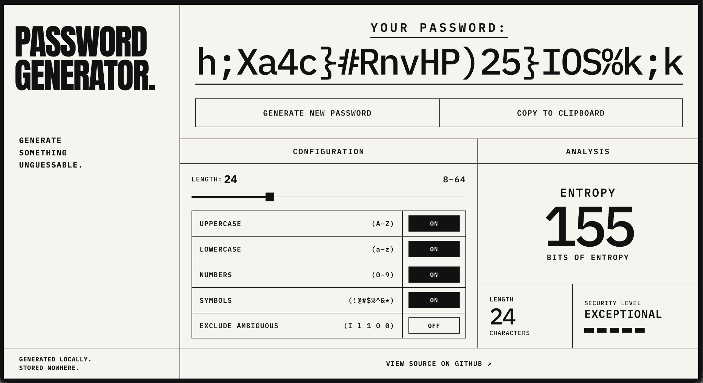
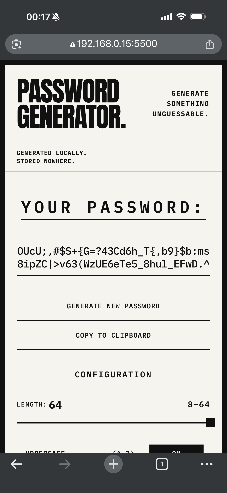

# Password Generator

> **A secure client-side password generator built around cryptographic randomness, exact entropy analysis, and a deliberately minimal interface.**


<p align="center">
  <a href="https://chrystianomoura.github.io/password-generator/">
    <strong>🌐 Acessar aplicação</strong>
  </a>
</p>



---

## Sobre o projeto

**Password Generator** é uma aplicação web para geração de senhas aleatórias executada inteiramente no navegador.

A interface permite escolher o comprimento da senha, habilitar ou desabilitar categorias de caracteres, excluir caracteres visualmente ambíguos e acompanhar uma análise baseada no espaço real de resultados válidos para a configuração selecionada.

Apesar da proposta visualmente simples, o projeto foi construído para explorar problemas que normalmente ficam escondidos atrás de um botão de geração:

- de onde deve vir a aleatoriedade;
- como evitar viés durante a seleção dos caracteres;
- como garantir as categorias escolhidas sem distorcer a distribuição final;
- como medir o espaço efetivo de senhas possíveis;
- como transformar esse espaço em uma estimativa de entropia;
- como manter lógica, interface e infraestrutura do navegador separadas e testáveis.

A implementação utiliza **HTML, CSS e JavaScript puro**, sem frameworks JavaScript e sem dependências de runtime.

---

## Funcionalidades

- Geração de senhas entre **8 e 64 caracteres**.
- Letras maiúsculas `A–Z`.
- Letras minúsculas `a–z`.
- Números `0–9`.
- Símbolos.
- Exclusão opcional dos caracteres ambíguos `I`, `l`, `1`, `O` e `0`.
- Garantia de pelo menos um caractere de cada categoria selecionada.
- Aleatoriedade criptograficamente segura através da **Web Crypto API**.
- Seleção uniforme de caracteres sem modulo bias.
- Cálculo do número exato de senhas válidas para a configuração atual.
- Estimativa de entropia em bits.
- Classificação visual do nível de segurança.
- Cópia para a área de transferência com estratégia de fallback.
- Layout responsivo para desktop, tablet e mobile.
- Interface preparada para mouse, teclado e toque.
- Regiões de status e estados de controles comunicados semanticamente.

---

## Como a geração funciona

O gerador não utiliza `Math.random()`.

A fonte de aleatoriedade é `crypto.getRandomValues()`, disponibilizada pela Web Crypto API e adequada à geração de valores que dependem de aleatoriedade criptograficamente segura.

O fluxo principal pode ser representado assim:

```text
Configuração do usuário
        │
        ▼
Conjuntos de caracteres ativos
        │
        ▼
Pool completo de caracteres
        │
        ▼
crypto.getRandomValues()
        │
        ▼
Inteiros uniformes
        │
        ▼
Senha candidata
        │
        ▼
Contém todas as categorias?
      /     \
    não     sim
     │       │
     └──↺    ▼
          Senha válida
```

### CSPRNG

Cada posição da senha é escolhida a partir de um gerador de números pseudoaleatórios criptograficamente seguro (**CSPRNG**).

Caso `crypto.getRandomValues()` não esteja disponível, o motor interrompe a geração em vez de substituir silenciosamente a fonte criptográfica por uma alternativa mais fraca.

### Eliminação de modulo bias

Transformar diretamente um inteiro aleatório através de:

```text
randomValue % tamanhoDoConjunto
```

pode produzir uma distribuição levemente desigual quando o tamanho do conjunto não divide exatamente o intervalo de valores possíveis do inteiro aleatório.

O projeto evita esse problema através de **rejection sampling**.

Primeiro é calculado o maior intervalo que pode ser dividido uniformemente pelo tamanho desejado. Valores pertencentes à região excedente são descartados e uma nova amostra é solicitada.

Somente depois disso a operação de módulo é aplicada.

### Garantia das categorias selecionadas

Quando várias categorias estão habilitadas, uma senha válida precisa conter pelo menos um caractere de cada uma delas.

Em vez de inserir manualmente um caractere obrigatório de cada categoria em posições específicas, o gerador cria candidatos utilizando o **pool completo** e aceita apenas aqueles que satisfazem todas as condições.

Como cada candidato nasce da mesma distribuição e a rejeição depende apenas de sua validade, as senhas aceitas permanecem equiprováveis dentro do espaço válido definido pela configuração.

---

## Entropia e espaço de busca

A interface apresenta uma estimativa de entropia calculada a partir do número de senhas que o próprio gerador pode produzir.

A relação utilizada é:

```text
H = log₂(N)
```

onde:

- `H` representa a entropia em bits;
- `N` representa a quantidade de senhas válidas possíveis.

### Por que não usar apenas `poolSize ^ length`?

Se quatro categorias estiverem habilitadas, o motor exige que a senha contenha pelo menos um caractere de cada categoria.

Portanto, nem toda sequência possível do pool completo é válida.

O espaço real precisa excluir, por exemplo:

- senhas sem letras maiúsculas;
- senhas sem letras minúsculas;
- senhas sem números;
- senhas sem símbolos;
- e as interseções entre essas situações.

Para obter essa quantidade, `password-entropy.js` utiliza o **princípio da inclusão-exclusão**.

De forma simplificada:

```text
válidas =
    todas
  - sem categoria A
  - sem categoria B
  + sem categorias A e B
  ...
```

### BigInt

O número de combinações cresce muito rapidamente.

Por isso, a contagem é realizada com `BigInt`, evitando perda de precisão durante o cálculo do espaço de senhas.

Na conversão desse espaço para entropia, o módulo calcula `log₂` sem converter diretamente BigInts muito grandes para `Number`. Para valores maiores, apenas os bits mais significativos necessários são utilizados na aproximação em ponto flutuante.

---

## Classificação de segurança

Depois do cálculo da entropia, `password-strength.js` converte o resultado em uma classificação simples para a interface:

| Entropia | Classificação | Barras |
| ---: | --- | :---: |
| `< 40 bits` | Weak | 1 |
| `40–59.999 bits` | Fair | 2 |
| `60–79.999 bits` | Strong | 3 |
| `80–119.999 bits` | Very Strong | 4 |
| `≥ 120 bits` | Exceptional | 5 |

Esses limites são uma **heurística interna da aplicação** para apresentação do resultado. Eles não representam níveis oficiais ou uma certificação de segurança.

---

## Arquitetura

O JavaScript foi dividido em módulos com responsabilidades específicas:

```text
                         ┌─────────────────────┐
                         │       main.js       │
                         │     Orquestração    │
                         └──────────┬──────────┘
                                    │
            ┌───────────────────────┼───────────────────────┐
            │                       │                       │
            ▼                       ▼                       ▼
┌─────────────────────┐  ┌─────────────────────┐  ┌─────────────────────┐
│ password-generator  │  │  password-entropy   │  │      clipboard      │
│      Geração        │  │      Análise        │  │       Cópia         │
└──────────┬──────────┘  └──────────┬──────────┘  └─────────────────────┘
           │                        │
           └───────────┬────────────┘
                       ▼
          ┌─────────────────────────┐
          │ password-character-sets │
          │  Conjuntos de caracteres│
          └─────────────────────────┘

                         ┌─────────────────────┐
                         │  password-strength  │
                         │   Classificação     │
                         └─────────────────────┘
```

### `main.js`

É a camada de orquestração da aplicação.

Conecta os módulos ao DOM e coordena:

- leitura das configurações;
- geração de novas senhas;
- atualização do range de comprimento;
- toggles das categorias;
- cálculo e apresentação da entropia;
- classificação de segurança;
- atualização das barras de força;
- cópia para o clipboard;
- mensagens de status;
- sincronização dos estados visuais e acessíveis dos controles.

A lógica criptográfica e matemática permanece fora desse módulo.

### `password-character-sets.js`

Funciona como a **fonte única de verdade** para os caracteres utilizados pelo gerador e pela análise.

Centraliza:

- letras maiúsculas;
- letras minúsculas;
- números;
- símbolos;
- caracteres ambíguos;
- filtragem dos conjuntos;
- construção das categorias efetivamente ativas.

Dessa forma, geração e cálculo de entropia trabalham sobre as mesmas definições.

### `password-generator.js`

Contém o motor de geração.

É responsável por:

- validar as opções;
- obter aleatoriedade criptograficamente segura;
- eliminar modulo bias;
- selecionar caracteres;
- gerar candidatos;
- verificar as categorias obrigatórias;
- retornar apenas senhas válidas.

O módulo não acessa o DOM, não armazena senhas e não utiliza `Math.random()`.

### `password-entropy.js`

Calcula o espaço de resultados válidos e sua entropia.

Entre suas responsabilidades estão:

- validação das opções;
- identificação das categorias ativas;
- contagem através de inclusão-exclusão;
- operações combinatórias com `BigInt`;
- cálculo de `log₂` para valores grandes;
- retorno da entropia em bits.

### `password-strength.js`

Mantém isolada a heurística responsável por transformar entropia em:

- label de segurança;
- quantidade de barras visuais.

Essa separação impede que os limites da classificação fiquem espalhados pela interface.

### `clipboard.js`

Abstrai a cópia da senha.

A estratégia utilizada é:

1. tentar `navigator.clipboard.writeText()`;
2. utilizar um fallback quando necessário;
3. propagar erro caso nenhuma estratégia consiga realizar a cópia.

O módulo não conhece os botões nem apresenta mensagens diretamente ao usuário.

---

## Fluxo da aplicação

Uma interação típica segue este caminho:

```text
Usuário
  │
  ▼
Interface
  │
  ▼
main.js
  │
  ├──────────────► password-generator.js
  │                         │
  │                         ▼
  │              password-character-sets.js
  │                         │
  │                         ▼
  │                    Nova senha
  │
  ├──────────────► password-entropy.js
  │                         │
  │                         ▼
  │                     Entropia
  │                         │
  ├──────────────► password-strength.js
  │                         │
  │                         ▼
  │                 Nível de segurança
  │
  ▼
Interface atualizada
```

A ação de copiar segue um caminho separado através de `clipboard.js`.

Essa organização mantém geração, análise matemática, classificação, integração com o navegador e manipulação do DOM em fronteiras distintas.

---

## Segurança e privacidade

O projeto foi desenvolvido para que a geração aconteça localmente no navegador.

### Decisões adotadas

- `crypto.getRandomValues()` como fonte de aleatoriedade.
- Nenhum uso de `Math.random()` no motor.
- Rejection sampling para eliminar modulo bias.
- Validação explícita das configurações recebidas.
- Falha segura quando a fonte criptográfica não está disponível.
- Nenhuma persistência implementada para as senhas.
- Nenhum backend necessário para a geração.
- Nenhuma requisição é necessária para enviar senhas a um servidor durante o processo de geração.
- A senha só é enviada ao clipboard quando o usuário solicita explicitamente a cópia.

> A classificação apresentada pela interface é uma estimativa baseada no espaço de resultados do gerador. A segurança prática de uma senha também depende de fatores externos à aplicação, como armazenamento, reutilização, exposição e políticas do serviço em que ela será utilizada.

---

## Testes automatizados

O projeto utiliza o **test runner nativo do Node.js**.

Estado atual da suíte:

```text
Tests:  65
Passed: 65
Failed: 0
```

Os testes estão divididos de acordo com os módulos de domínio:

```text
tests/
├── clipboard.test.js
├── password-entropy.test.js
├── password-generator.test.js
└── password-strength.test.js
```

### Geração

A suíte verifica comportamentos como:

- comprimentos mínimo, padrão e máximo;
- rejeição de comprimentos inválidos;
- validação das propriedades booleanas;
- geração utilizando categorias individuais;
- presença de todas as categorias selecionadas;
- exclusão dos caracteres ambíguos;
- ausência de caracteres fora do conjunto permitido;
- variação entre chamadas sucessivas;
- falha segura sem `crypto.getRandomValues()`.

### Entropia

São testados:

- espaços com uma, duas, três e quatro categorias;
- inclusão-exclusão;
- efeito da remoção de caracteres ambíguos;
- configurações sem categorias;
- comprimentos incompatíveis;
- entradas inválidas;
- consistência entre contagem e `log₂`;
- crescimento da entropia com o comprimento;
- espaços combinatórios muito grandes.

### Classificação

Os testes verificam exatamente as fronteiras entre:

- Weak;
- Fair;
- Strong;
- Very Strong;
- Exceptional.

Também são rejeitados valores negativos, infinitos, `NaN` e entradas que não sejam números.

### Clipboard

A suíte cobre:

- validação da entrada;
- Clipboard API moderna;
- fallback;
- falha da API moderna seguida de fallback;
- indisponibilidade completa das estratégias;
- falha reportada pelo mecanismo legado;
- preservação das causas quando ambas as estratégias falham.

Para executar todos os testes:

```bash
npm test
```

---

## Responsividade

A interface possui adaptações específicas para diferentes larguras e formas de interação.

No desktop, configuração e análise permanecem lado a lado, aproveitando o espaço horizontal e preservando a composição tipográfica principal.

Em telas menores, a estrutura é reorganizada para leitura vertical. Controles, cards de análise e ações passam a ocupar o espaço disponível sem reduzir excessivamente as áreas interativas.

A exibição da senha também possui tratamento para comprimentos maiores, permitindo que sequências extensas permaneçam legíveis dentro da composição.

### Mobile

<p align="center">
  
</p>

A versão mobile preserva as mesmas capacidades da aplicação, incluindo configuração completa, análise de entropia, classificação e geração de senhas de até 64 caracteres.

---

## Acessibilidade

A estrutura e os estados da interface incorporam práticas de acessibilidade como:

- HTML semântico;
- headings associados às seções;
- controles nativos de formulário;
- `label` associado ao controle de comprimento;
- botões toggle com `aria-pressed`;
- nomes acessíveis para controles;
- regiões `aria-live` para atualizações relevantes;
- `role="status"` para mensagens operacionais;
- uso coerente do estado `disabled`;
- elementos puramente visuais ocultados de tecnologias assistivas;
- estados de foco visíveis;
- suporte a diferentes formas de interação.

A classificação de segurança possui representação textual própria; as barras funcionam como complemento visual e não como única forma de comunicar o estado.

---

## Tecnologias utilizadas

### Front-end

- **HTML5** — estrutura semântica e acessibilidade.
- **CSS3** — identidade visual, layout e responsividade.
- **JavaScript** — comportamento e lógica da aplicação.
- **ES Modules** — organização modular do código.

### APIs da plataforma web

- **Web Crypto API** — aleatoriedade criptograficamente segura.
- **Clipboard API** — cópia moderna para a área de transferência.
- **DOM API** — integração entre aplicação e interface.

### Desenvolvimento e testes

- **Node.js**
- **Node.js Test Runner**
- **Git**
- **GitHub**
- **GitHub Pages**

O projeto não utiliza framework JavaScript nem biblioteca externa para a lógica da aplicação.

---

## Estrutura do projeto

```text
password-generator/
├── assets/
│   ├── screenshots/
│   │   ├── desktop.png
│   │   └── mobile.png
│   │
│   ├── android-chrome-192x192.png
│   ├── android-chrome-512x512.png
│   ├── apple-touch-icon.png
│   ├── favicon-16x16.png
│   ├── favicon-32x32.png
│   └── favicon.ico
│
├── css/
│   └── style.css
│
├── js/
│   ├── clipboard.js
│   ├── main.js
│   ├── password-character-sets.js
│   ├── password-entropy.js
│   ├── password-generator.js
│   └── password-strength.js
│
├── tests/
│   ├── clipboard.test.js
│   ├── password-entropy.test.js
│   ├── password-generator.test.js
│   └── password-strength.test.js
│
├── .gitignore
├── LICENSE
├── index.html
├── package.json
└── README.md
```

Arquivos `.DS_Store` criados pelo macOS são ignorados pelo Git e, por isso, não fazem parte da estrutura versionada.

---

## Como executar

O projeto não possui processo de build nem dependências de runtime.

### 1. Clone o repositório

```bash
git clone https://github.com/chrystianomoura/password-generator.git
```

### 2. Entre no diretório

```bash
cd password-generator
```

### 3. Abra através de um servidor local

Como a aplicação utiliza ES Modules, recomenda-se executá-la através de HTTP em vez de abrir o `index.html` diretamente pelo protocolo `file://`.

No Visual Studio Code, uma opção é utilizar a extensão **Live Server**.

### 4. Execute os testes

É necessário possuir uma versão moderna do Node.js com suporte ao test runner nativo.

```bash
npm test
```

A suíte atual não depende de Jest, Vitest ou outra biblioteca de testes.

---

## Decisões técnicas

### JavaScript sem framework

O projeto foi desenvolvido com JavaScript puro para trabalhar diretamente com módulos, DOM, eventos e APIs nativas da plataforma web.

A ausência de framework não significa ausência de arquitetura: responsabilidades de domínio foram deliberadamente separadas da camada de interface.

### Fonte única para os conjuntos de caracteres

Geração e análise importam suas categorias de `password-character-sets.js`.

Isso evita manter duas definições independentes do mesmo alfabeto e reduz o risco de a interface calcular a segurança de um espaço diferente daquele utilizado pelo gerador.

### Distribuição uniforme antes da conveniência

A implementação evita atalhos que facilitariam a garantia das categorias, mas poderiam tornar mais difícil raciocinar sobre a distribuição resultante.

O motor gera candidatos uniformemente a partir do pool completo e utiliza rejeição para restringir o resultado ao conjunto válido.

### Entropia baseada no gerador real

A análise não utiliza apenas uma multiplicação aproximada entre tamanho do pool e comprimento.

Ela considera a mesma regra que o gerador aplica: todas as categorias selecionadas precisam estar presentes.

Isso conecta a métrica apresentada na interface ao espaço efetivamente produzido pelo motor.

### Integrações do navegador isoladas

A lógica de clipboard permanece em um módulo próprio, enquanto geração e entropia não dependem do DOM.

Essa separação melhora testabilidade e reduz o acoplamento entre regras da aplicação e infraestrutura do navegador.

---

## Limitações e escopo

A versão `1.0.0` possui um escopo deliberadamente client-side.

Algumas características importantes:

- não existe sistema de contas;
- não existe sincronização entre dispositivos;
- não existe armazenamento de senhas;
- não existe backend próprio;
- a aplicação não funciona como gerenciador de senhas;
- a classificação de força é uma heurística de interface, não uma auditoria ou certificação;
- o projeto avalia o espaço de geração, não vazamentos, reutilização ou contexto específico de uma senha.

Essas limitações mantêm o projeto concentrado em **geração, aleatoriedade, análise e apresentação**.

---

## O que este projeto representou

O Password Generator começou a partir de uma funcionalidade aparentemente pequena: produzir uma sequência aleatória de caracteres.

Ao aprofundar a implementação, o projeto passou a envolver conceitos que vão além da manipulação do DOM:

- aleatoriedade criptográfica;
- distribuição uniforme;
- rejection sampling;
- aritmética com `BigInt`;
- princípio da inclusão-exclusão;
- entropia;
- validação defensiva;
- separação de responsabilidades;
- testes automatizados;
- acessibilidade;
- responsividade;
- tratamento de diferenças entre APIs do navegador.

O principal aprendizado do projeto foi que **uma interface simples não precisa esconder uma implementação simplista**.

A complexidade foi colocada onde ela agrega valor — na correção da geração, na análise e na organização do código — enquanto a experiência do usuário permaneceu direta.

---

## Status do projeto

**Versão 1.0.0 — estável.**

```text
Tests:  65
Passed: 65
Failed: 0
```

A aplicação está preparada para publicação através do GitHub Pages:

**Live Demo:**  
https://chrystianomoura.github.io/password-generator/

---

## Licença

Este projeto é distribuído sob a licença **MIT**.

Consulte o arquivo [`LICENSE`](./LICENSE) para mais informações.

---

<p align="center">
  <strong>PASSWORD GENERATOR.</strong><br>
  <sub>Generated locally. Stored nowhere.</sub>
</p>
